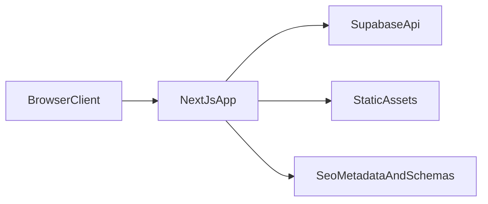
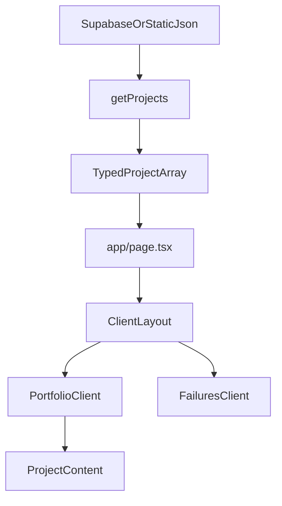

# System Design & Technical Architecture

This is the canonical system design document for the portfolio codebase.

## Scope

This document covers:
- System boundaries and runtime architecture
- Data model and data flow
- Component ownership and composition
- Performance, reliability, and observability decisions

This document does not cover:
- Interaction behavior details
- Visual style and design tokens

For UI/UX details, see `docs/UI_UX_DESIGN.md`.

## Architecture Summary

- **Framework**: Next.js App Router with server-first rendering and client interactivity where needed.
- **Data Source**: Supabase-backed portfolio and failures content, normalized through typed mappings.
- **UI Layer**: React + Tailwind CSS + Framer Motion.
- **Deployment Target**: Vercel-compatible static/dynamic build pipeline.
- **SEO Layer**: Metadata + sitemap + JSON-LD structured data generated from app content.

## System Context

## Runtime Composition

- `app/layout.tsx`: global metadata, structured data injection, providers.
- `app/page.tsx`: app entry that loads projects and renders the client layout.
- `app/components/ClientLayout.tsx`: route-level composition, theme coordination, section orchestration.
- `app/components/PortfolioClient.tsx`: interactive portfolio modal/list flows for desktop and mobile.
- `app/components/ProjectContent.tsx`: project details rendering with STAR blocks, tags, and CTAs.
- `app/components/FailuresClient.tsx`: failures stream and detail overlay.
- `lib/getProjects.ts`: project retrieval and normalization.
- `lib/hooks/*`: local behavioral hooks (`useTheme`, `usePortfolio`, `useFailures`, etc.).

## Data Contracts

- Canonical domain types are in `types/project.ts`.
- Project data supports:
  - identity and timeline fields (`id`, `title`, `year`, `category`)
  - STAR narrative fields (`situation`, `task`, `result`)
  - measurable outcomes (`keyResults`)
  - presentation metadata (`tags`, media URLs, CTA URLs, collaborators)
- Failure items follow a parallel structure for consistent rendering patterns.

## Data Flow

## State Strategy

- **Server state**: page-level content loading and normalization.
- **Client state**:
  - modal open/close and selected project/failure
  - current index for mobile swipe navigation
  - theme and reduced-motion handling
- **Derived state**:
  - collection switching (`projects`, `invitations`, `deepDives`)
  - conditional section visibility based on content availability

## Performance and Reliability

- Dynamic imports for non-critical visual layers.
- Memoization for heavy detail render paths.
- Responsive media components to control image/video cost.
- Reduced-motion support to avoid expensive transitions on constrained contexts.
- Error boundaries and fallback rendering components for resilience.

## SEO and Discoverability Architecture

- Metadata and keyword strategy centralized in `app/layout.tsx`.
- Structured data defined in `app/components/StructuredData.tsx`.
- Project-level schema extension in `app/components/ProjectStructuredData.tsx`.
- Sitemap generated by `app/sitemap.ts`.

## Documentation Ownership

- System design owner doc: `docs/TECHNICAL_ARCHITECTURE.md`
- UI/UX owner doc: `docs/UI_UX_DESIGN.md`
- Product requirements owner doc: `docs/PROJECT_SPEC.md`
- SEO owner doc: `docs/seo/SEO_FINAL_SUMMARY.md`

---

*Last updated: March 2026*
